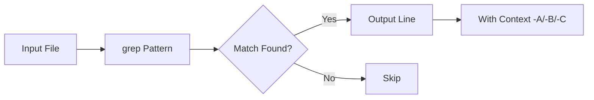
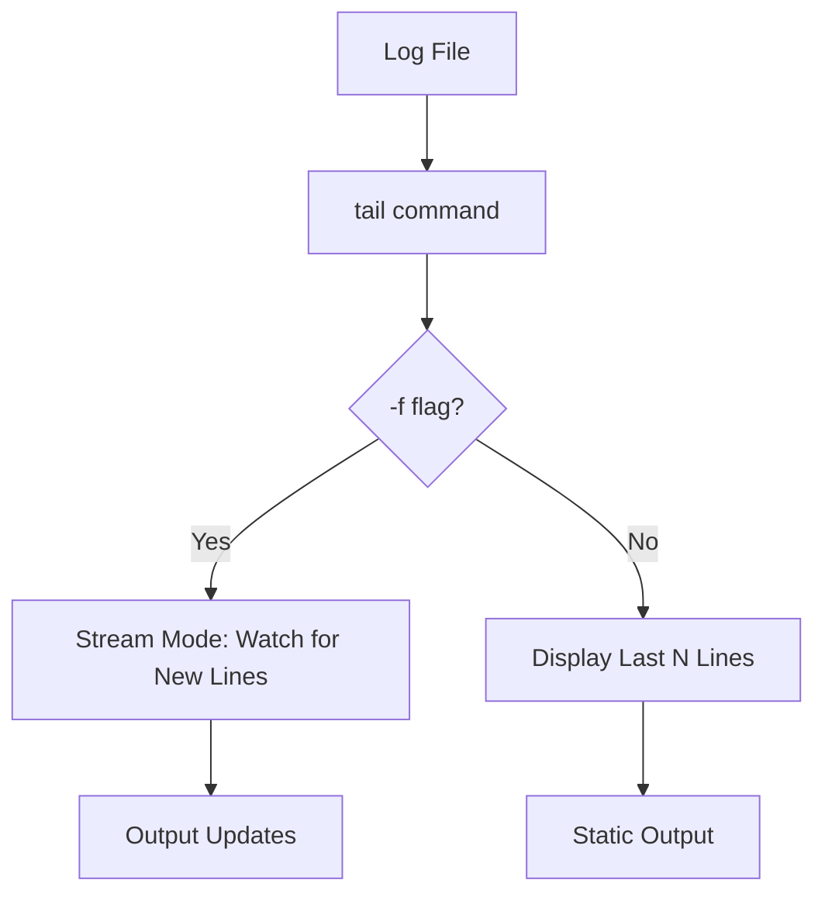
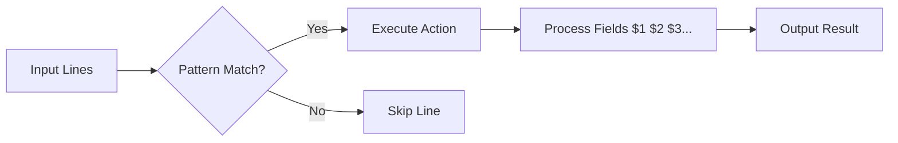
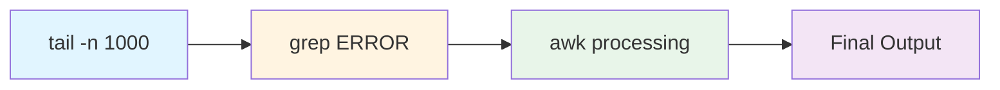
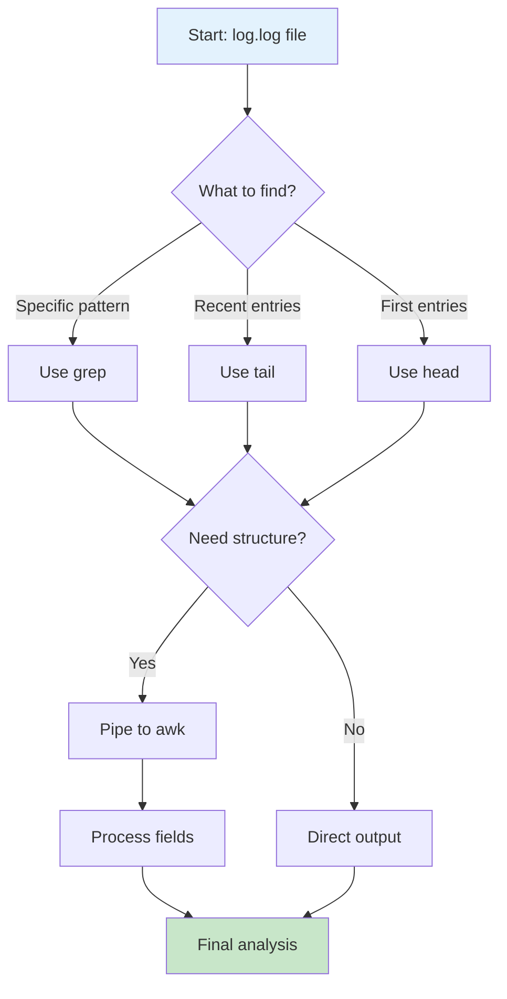
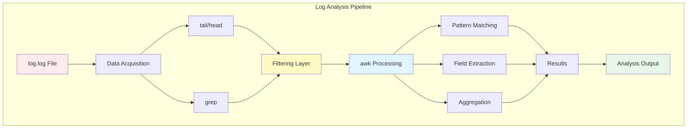

# Log Analysis Commands - Homework Assignment

## Overview
This homework assignment focuses on mastering essential Linux/Unix command-line tools for log file analysis. You will work with real system logs to extract meaningful information using pattern matching, text processing, and stream manipulation commands.

**Time Limit:** 20 minutes  
**Dataset:** `log.log` file (included in this repository)

---

## Command Reference

### 1. grep - Search and Filter Text

The `grep` command searches for patterns in files.

#### Syntax
```bash
grep [OPTIONS] PATTERN [FILE]
```

#### Key Flags

- **`-i`**: Case-insensitive search
  ```bash
  grep -i "error" log.log
  ```

- **`-E`**: Extended regex (enables advanced patterns like `|`, `+`, `?`)
  ```bash
  grep -E "ERROR|WARNING|INFO" log.log
  ```

- **`-A NUM`**: Show NUM lines **After** matching line
  ```bash
  grep -A 3 "ERROR" log.log
  ```

- **`-B NUM`**: Show NUM lines **Before** matching line
  ```bash
  grep -B 2 "ERROR" log.log
  ```

- **`-C NUM`**: Show NUM lines of **Context** (before and after)
  ```bash
  grep -C 2 "ERROR" log.log
  ```

#### Visual Flow


---

### 2. tail - View End of Files

The `tail` command displays the last part of files.

#### Key Flags

- **`-n NUM`**: Show last NUM lines
  ```bash
  tail -n 50 log.log
  ```

- **`-f`**: Follow file in real-time (useful for live logs)
  ```bash
  tail -f log.log
  ```

#### Visual Flow


---

### 3. head - View Beginning of Files

The `head` command displays the first part of files.

#### Key Flags

- **`-n NUM`**: Show first NUM lines
  ```bash
  head -n 20 log.log
  ```

**Note:** `head` typically doesn't have `-f` flag (that's for `tail`)

---

### 4. awk - Pattern Scanning and Processing

The `awk` command is a powerful text processing tool that can filter, transform, and analyze structured text.

#### Syntax
```bash
awk 'pattern {action}' file
```

#### Common Patterns

**Print specific columns:**
```bash
awk '{print $1, $2, $3}' log.log
```

**Filter by pattern:**
```bash
awk '/ERROR/ {print $0}' log.log
```

**Count occurrences:**
```bash
awk '/ERROR/ {count++} END {print count}' log.log
```

**Conditional processing:**
```bash
awk '$3 == "ERROR" {print $1, $2, $5}' log.log
```

#### Visual Flow


---

## Command Combinations

### Piping Commands Together

Linux commands become powerful when combined using pipes (`|`).



#### Example 1: tail + grep
```bash
# Get last 100 lines and filter for ERROR
tail -n 100 log.log | grep -i "error"
```

#### Example 2: tail + grep + awk
```bash
# Get last 500 lines, find MQTT messages, extract timestamp
tail -n 500 log.log | grep "MQTT" | awk '{print $1, $2, $6}'
```

#### Example 3: grep with context + awk
```bash
# Find ERROR with context, extract specific fields
grep -C 2 "ERROR" log.log | awk '/ERROR/ {print $1, $2, "ERROR at line"}'
```

---

## Homework Tasks

### Setup
1. Clone this repository from GitHub Classroom
2. Navigate to the repository directory
3. Ensure `log.log` is present in the directory

---

### Task 1: Basic grep Operations (5 points)

Create a file called `task1_results.txt` with the following:

1. Find all lines containing "ERROR" (case-insensitive)
2. Find all lines with "DEBUG" or "INFO" or "WARNING" using extended regex
3. Find "SELFTEST" and show 5 lines after each match
4. Find "alarm" (case-insensitive) with 2 lines before and after

**Deliverable:** Commands used and line counts for each search

---

### Task 2: tail and head Operations (3 points)

Create a file called `task2_results.txt` with:

1. Display the last 25 lines of the log
2. Display the first 10 lines of the log
3. What's the difference in timestamps between the first and last log entries?

**Deliverable:** Output of commands and timestamp analysis

---

### Task 3: awk Processing (5 points)

Create a file called `task3_results.txt` with:

1. Count how many times each log level (DEBUG, INFO, WARNING, ERROR, SUCCESS) appears
2. Extract and display only timestamp (columns 1-2) and log level (column 3)
3. Find all lines from the "AlarmNotifier.py" file and print timestamp + message

**Deliverable:** Commands used and results

---

### Task 4: Combined Commands (7 points)

Create a file called `task4_results.txt` with:

1. **tail + grep**: Get last 100 lines and filter for "MQTT" messages
2. **tail + grep + awk**: Get last 200 lines, find "Published MQTT MSG", extract timestamps
3. **grep + awk**: Find all "ERROR" entries and count how many unique Python files generated errors

**Bonus Challenge:** Use tail + grep + awk to find the average number of "wrapper_inspection.py" log entries per minute in the last 50 lines.

**Deliverable:** All commands used and analysis results

---

## Analysis Workflow



---

## Submission Guidelines

### What to Submit

1. **Four result files:**
   - `task1_results.txt`
   - `task2_results.txt`
   - `task3_results.txt`
   - `task4_results.txt`

2. **Each file should contain:**
   - The commands you used
   - The output/results
   - Brief explanation (1-2 sentences)

### File Format Example

```
=== Task 1.1: Find ERROR lines (case-insensitive) ===
Command:
grep -i "error" log.log | wc -l

Output:
42

Explanation:
Found 42 lines containing "error" in any case variation.

---
```

### Submission Process

1. Complete all tasks
2. Add your result files to git:
   ```bash
   git add task1_results.txt task2_results.txt task3_results.txt task4_results.txt
   ```

3. Commit your changes:
   ```bash
   git commit -m "Complete log analysis homework"
   ```

4. Push to GitHub Classroom:
   ```bash
   git push origin main
   ```

---


## Tips and Best Practices

1. **Test incrementally:** Run each command separately before combining
2. **Use `wc -l`:** Count lines with `| wc -l`
3. **Redirect output:** Save results with `> output.txt`
4. **Check patterns:** Use simple grep first, then add complexity
5. **Read man pages:** `man grep`, `man awk`, `man tail`

---

## Command Cheat Sheet

```bash
# Pattern matching
grep -i "pattern" file              # Case-insensitive search
grep -E "pat1|pat2" file            # Multiple patterns
grep -C 3 "pattern" file            # 3 lines context

# File navigation
tail -n 50 file                     # Last 50 lines
head -n 20 file                     # First 20 lines
tail -f file                        # Follow real-time

# Text processing
awk '{print $1, $3}' file           # Print columns 1 and 3
awk '/pattern/ {count++} END {print count}' file  # Count matches
awk -F':' '{print $2}' file         # Custom delimiter

# Combinations
tail -n 100 file | grep "ERROR"     # Recent errors
grep "WARN" file | awk '{print $1}' # Timestamps of warnings
```

---

## Resources

- [GNU Grep Manual](https://www.gnu.org/software/grep/manual/)
- [AWK Tutorial](https://www.grymoire.com/Unix/Awk.html)
- [Linux Command Line Basics](https://ubuntu.com/tutorials/command-line-for-beginners)

---

## Questions?

If you encounter issues:
1. Check command syntax
2. Verify file paths
3. Review error messages carefully
4. Test with simpler versions of commands first

**Good luck! 🚀**

---

## Architecture Overview



---

**Repository:** Submit via GitHub Classroom  
